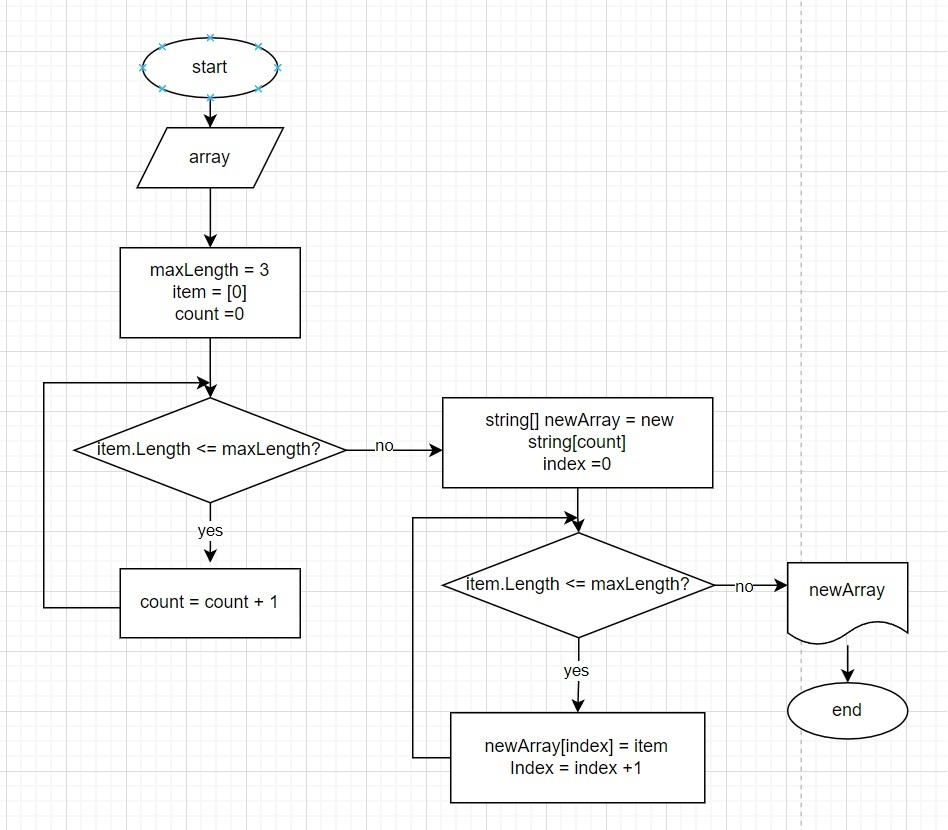

# Lesson-1.-Final-control-work
## Итоговая контрольная работа по основному блоку

* Пунк 1.

### Создана задача *Task*. В ней написан код по решению задачи: на ввод программа принимает любые значения введенные с клавиатуры - цифры, слова и другие элементы, и выводит только те элементы, которые соотвествуют условию: количество символов должно быть меньше или равно 3 символам.
* *Создана функция*
```sh
FilterArrayByLengt
```
*которая запрашивает ввести массив элементов через пробел и проверяет все введенные элементы массива **item** на условие соответсвия длины <= 3 (трём) символам*

* *Также в функции **FilterArrayByLengt** создается новый массив*
```sh
newArray
```
*размер которого соответсвует количеству элементов отфильтрованного исходного массива*

* *Далее уже в новом массиве **newArray** все элементы **item** проверяются на условие <= 3 (трём) и все элементы, удовлетвияющие условию, записываются в новый массив и возвращаются **return***

* *Добавлена функция*
```sh
PrintArray
```
*которая перебирает все отфильтрованные элементы **item** и выводит их на консоль*

* Пункт 2
### Создана блок схема программы 
### WEB ссылка на блок-схему [https://drive.google.com/file/d/13coel_E2mQazPJZpqaDUwEM_lqVw6y4N/view?usp=sharing]